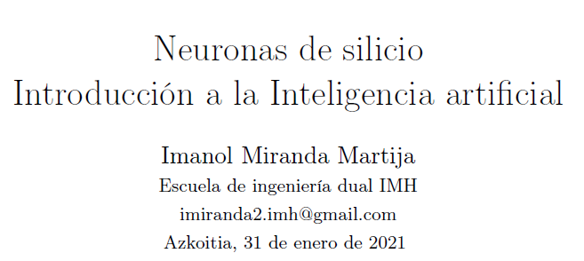

# PROJECT 1: <a href="https://drive.google.com/file/d/1SMhT4I5KEW4q8PZr8d5GTpkCVgOt3J79/preview" target="_blank">Neuronas de silicio</a>
Primer artículo relacionado con la IA:

# PROJECT 2 <a href="https://github.com/ImanolMir/Diagn-stico-de-competitividad-territorial" target="_blank">Herramienta desarrollada para el diagnóstico</a>

* Herramienta desarrollada para analizar la competitividad territorial de las comarcas del País Vasco.
* Inicialmente sólo se solicitó el análisis de dos comarcas, pero se decidió crear una herramienta que facilitara el análisis de cualquiera de las comarcas de forma dinámica.
* Los principales indicadores analizados durante el trabajo se relacionan entre sí mediante gráficos dinámicos.
* Utilizando plotly y dash intentamos crear algo similar a un cuadro de mando.

