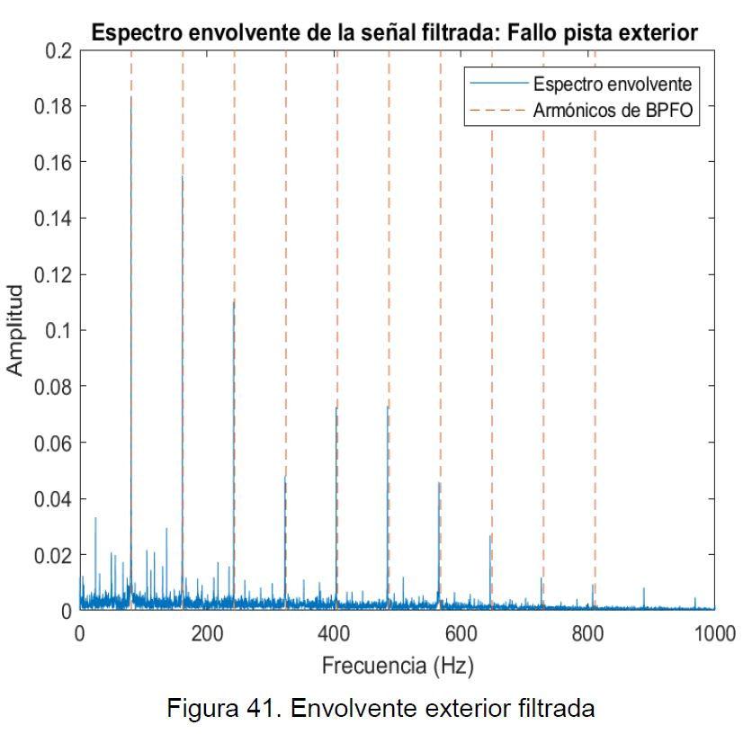

# PROJECT 1: <a href="https://drive.google.com/file/d/1SMhT4I5KEW4q8PZr8d5GTpkCVgOt3J79/preview" target="_blank">Neuronas de silicio</a>
Durante el tercer curso de la carrera, se realiza el siguiente artículo relacionado con la inteligencia artificial. Para dar formato se utiliza Latex.

 

# PROJECT 2: MONITORIZACIÓN DE FALLOS EN RODAMIENTOS EN MATLAB

Simulación numérica realizada durante el tercer curso mediante Matlab.
* Primero se analizan el dominio del tiempo y de frecuencia de la señal.

* Se realiza la transformada de Hilbert.

* En caso de no observar nada representativo, mediante el curtograma se obtienen la longitud de ventana, la frecuencia centrada y el ancho de banda.

* Con los datos obtenidos se aplica un filtro de paso de banda.

* Se realiza la transformada de Hilbert y se representan las frecuencias de fallo.

# PROJECT 3: <a href="https://github.com/ImanolMir/Diagn-stico-de-competitividad-territorial" target="_blank">Herramienta desarrollada para el diagnóstico</a>

* Herramienta desarrollada por Eduard Zuluaga e Imanol Miranda para analizar la competitividad territorial de las comarcas del País Vasco.
* Inicialmente sólo se solicitó el análisis de dos comarcas, pero se decidió crear una herramienta que facilitara el análisis de cualquiera de las comarcas de forma dinámica.
* Los principales indicadores analizados durante el trabajo se relacionan entre sí mediante gráficos dinámicos.
* Utilizando plotly y dash intentamos crear algo similar a un cuadro de mando.

